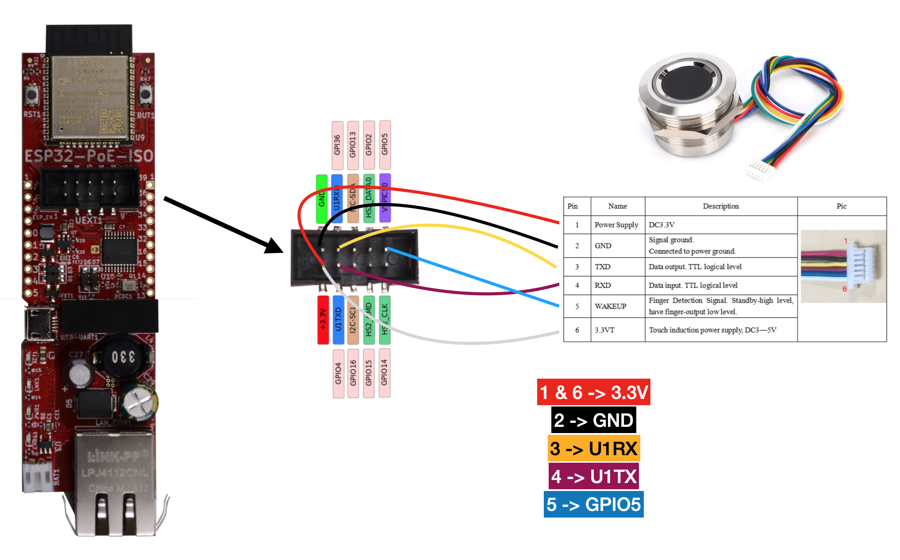

# FingerprintDoorbell PoE

Fork of [frickelzeugs](https://github.com/frickelzeugs)' awesome [FingerprintDoorbell](https://github.com/frickelzeugs/FingerprintDoorbell) with some modifications so that it runs on an [Olimax ESP32-POE-ISO](https://www.olimex.com/Products/IoT/ESP32/ESP32-POE-ISO/open-source-hardware) board.

For more information, take a look at the [original README](https://github.com/frickelzeugs/FingerprintDoorbell/blob/master/README.md).

## Changes

- removed all WiFi related code
- enabled ethernet connection (DHCP)
- disabled breathing LED when idle
- disabled external ringer signal (the pin is used in the ETH connection)
- use GPIO14 as input for the doorbell ring event (for a dedicated button to just ring)
- use GPIO15 as output for a buzzer for an acoustic feedback while the doorbell button is pressed
- remove all NTP related code (see https://github.com/frickelzeugs/FingerprintDoorbell/issues/84)
- the MQTT broker is resolved and connected once ethernet reports an IP address, and keeps retrying
- the hostname is fixed to `FingerprintDoorbell`, since the WiFi config page that used to set it is gone

## Wiring



## Build & Flash

Firmware and web UI are flashed separately. The web UI lives in `data/` and is uploaded as a SPIFFS image — without that second step the device serves an empty page.

```
pio run -t upload      # firmware
pio run -t uploadfs    # web UI (data/)
```

Later firmware updates can also be done over the network at `http://<device>/update`. Changes below `data/` always need `uploadfs`.

`data/bootstrap.min.css.gz` is stored pre-compressed and served with `Content-Encoding: gzip` — if you replace it, keep it gzipped.

## Case
A suitable 3D-printable case can be found on my [makerworld profile](https://makerworld.com/en/models/1006813-case-for-the-olimex-esp32-poe-iso-board#profileId-985426)
