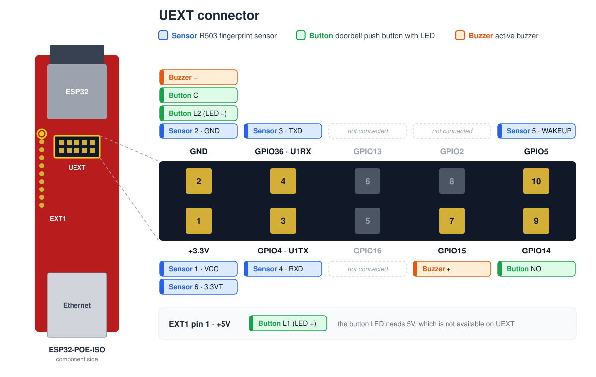
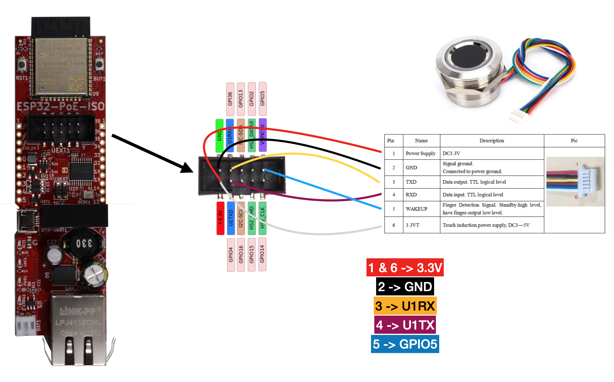

# FingerprintDoorbell PoE

Fork of [frickelzeugs](https://github.com/frickelzeugs)' awesome [FingerprintDoorbell](https://github.com/frickelzeugs/FingerprintDoorbell) with some modifications so that it runs on an [Olimax ESP32-POE-ISO](https://www.olimex.com/Products/IoT/ESP32/ESP32-POE-ISO/open-source-hardware) board.

For more information, take a look at the [original README](https://github.com/frickelzeugs/FingerprintDoorbell/blob/master/README.md).

## Changes in this fork

Removed:

- removed all WiFi related code
- removed all NTP related code (see https://github.com/frickelzeugs/FingerprintDoorbell/issues/84)
- disabled breathing LED when idle
- disabled external ringer signal (the pin is used in the ETH connection)
- the hostname is fixed to `FingerprintDoorbell`, since the WiFi config page that used to set it is gone
- an unknown finger on the sensor no longer rings the doorbell, only the doorbell button publishes to `ring`
- removed the hidden `CUSTOM_GPIOS` build option (spare GPIOs as `customInput1/2` and `customOutput1/2` over MQTT)

Fixed:

- the MQTT broker is resolved and connected once ethernet reports an IP address, and keeps retrying
- MQTT log messages longer than 256 bytes are no longer silently dropped (buffer raised to 512 bytes)
- the web UI no longer needs internet access, bootstrap is served gzipped from flash instead of a CDN
- the build works again with the renamed `ESPAsyncWebServer` PlatformIO package

Added:

- enabled ethernet connection (DHCP)
- added GPIO14 as input for the doorbell ring event (for a dedicated button to just ring), see [Doorbell button](#doorbell-button)
- added GPIO15 as output for a buzzer for an acoustic feedback while the doorbell button is pressed, see [Buzzer](#buzzer)
- added an optional mailbox sensor: reed contacts on GPIO13 (flap) and GPIO16 (door) publish MQTT events, see [Mailbox sensor](#mailbox-sensor)

## Wiring



The original photo-based diagram (without the mailbox sensor):



## Fingerprint sensor

An R503 fingerprint sensor is connected to the UEXT connector and talks to the ESP32 over UART (Serial1, 57600 baud). If it does not answer at boot, the firmware tries once more after 5 seconds; without a sensor the rest of the device (web UI, MQTT, button, buzzer, mailbox) keeps working.

| Sensor wire | Connected to |
|---|---|
| 1 · VCC | UEXT pin 1 (+3.3V) |
| 2 · GND | UEXT pin 2 (GND) |
| 3 · TXD | UEXT pin 4 (GPIO36, U1RX) |
| 4 · RXD | UEXT pin 3 (GPIO4, U1TX) |
| 5 · WAKEUP | UEXT pin 10 (GPIO5) |
| 6 · 3.3VT | UEXT pin 1 (+3.3V) |

Fingerprints are enrolled, renamed and deleted in the web UI (memory slots 1–200). The templates are stored on the sensor, the names on the ESP32.

Scan results are published (not retained) whenever the result changes:

| Topic | Match | No match / no finger |
|---|---|---|
| `<rootTopic>/matchId` | slot id | `-1` |
| `<rootTopic>/matchName` | name | empty |
| `<rootTopic>/matchConfidence` | confidence | `-1` |

A match is only published while the sensor pairing is valid. On first boot the ESP32 writes a pairing code to the sensor; if a different sensor answers later, matches are no longer sent and the web UI shows a security warning until you re-pair in the settings. An unknown finger is not a doorbell ring, only the [doorbell button](#doorbell-button) publishes to `<rootTopic>/ring`.

The WAKEUP wire is the sensor's capacitive touch ring, which detects a finger faster than the image sensor alone but also reacts to rain. Publish `on` to `<rootTopic>/ignoreTouchRing` to only use the image sensor (e.g. from a rain sensor), `off` to use the ring again.

The LED ring is off while idle, flashes red while touched, turns purple on a match and stays red if the sensor could not be found at boot.

## Doorbell button

A normally open push button between GPIO14 and GND rings the doorbell without a fingerprint. The internal pull-up is used, no resistor is needed. The button LED is not switched by the firmware; it is wired to +5V and GND and is always on.

| Button terminal | Connected to |
|---|---|
| NO | UEXT pin 9 (GPIO14) |
| C | UEXT pin 2 (GND) |
| L1 (LED +) | EXT1 pin 1 (+5V) |
| L2 (LED −) | UEXT pin 2 (GND) |

The button state is published to `<rootTopic>/ring` (not retained): `on` while it is pressed, `off` when it is released. A press while the broker is unreachable is replayed after reconnecting, as `on` followed by the current state, but only if it happened less than 5 minutes ago. On every (re)connect the current state is published once more, so a missed `off` gets repaired.

The button is read once per loop iteration. While the device is busy with the fingerprint sensor, e.g. for 3 seconds after a match, a very short press can be missed.

```yaml
mqtt:
  binary_sensor:
    - name: "Doorbell"
      state_topic: "fingerprintDoorbell/ring"
      payload_on: "on"
      payload_off: "off"
```

## Buzzer

An active buzzer between GPIO15 and GND gives acoustic feedback at the door. It has no MQTT topic.

| Buzzer terminal | Connected to |
|---|---|
| + | UEXT pin 7 (GPIO15) |
| − | UEXT pin 2 (GND) |

It plays a short rising tone sequence after booting and while the doorbell button is pressed, and stops when the button is released.

## Mailbox sensor

Two normally open reed contacts between a GPIO and GND (UEXT pin 2) report when the mailbox is used. Both are optional; a pin with nothing connected never triggers an event.

| Contact | UEXT pin | GPIO | MQTT topic |
|---|---|---|---|
| Mail slot flap | 6 | GPIO13 | `<rootTopic>/mailbox/flap` |
| Mailbox door | 5 | GPIO16 | `<rootTopic>/mailbox/door` |

Opening a contact publishes the payload `opened` (not retained) and adds a line to the log. An opening only counts after the contact was quiet for 1 second, which filters contact bounce and a rattling flap. Events that happen while the broker is unreachable are published once the connection is back (the latest one per contact, in the order they happened).

The device only reports events; whether there is mail is up to Home Assistant. An MQTT event entity for the flap looks like this (same for the door):

```yaml
mqtt:
  event:
    - name: "Mailbox flap"
      state_topic: "fingerprintDoorbell/mailbox/flap"
      event_types: ["opened"]
      value_template: '{"event_type": "{{ value }}"}'
```

## Build & Flash

Firmware and web UI are flashed separately. The web UI lives in `data/` and is uploaded as a SPIFFS image — without that second step the device serves an empty page.

```
pio run -t upload      # firmware
pio run -t uploadfs    # web UI (data/)
```

Later firmware updates can also be done over the network at `http://<device>/update`. Changes below `data/` always need `uploadfs`.

`data/bootstrap.min.css.gz` is stored pre-compressed and served with `Content-Encoding: gzip` — if you replace it, keep it gzipped.

## Case
A suitable 3D-printable case can be found on my [makerworld profile](https://makerworld.com/en/models/1006813-case-for-the-olimex-esp32-poe-iso-board#profileId-985426)
