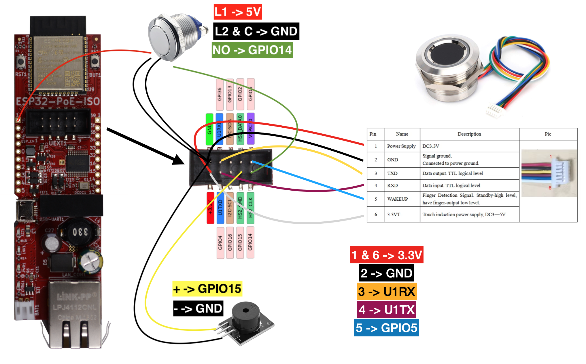

# FingerprintDoorbell PoE

Fork of [frickelzeugs](https://github.com/frickelzeugs)' awesome [FingerprintDoorbell](https://github.com/frickelzeugs/FingerprintDoorbell) with some modifications so that it runs on an [Olimax ESP32-POE-ISO](https://www.olimex.com/Products/IoT/ESP32/ESP32-POE-ISO/open-source-hardware) board.

For more information, take a look at the [original README](https://github.com/frickelzeugs/FingerprintDoorbell/blob/master/README.md).

## Changes

- removed all WiFi related code
- enabled ethernet connection (DHCP)
- disabled breathing LED when idle
- disabled external ringer signal (the pin is used in the ETH connection)

## Wiring

